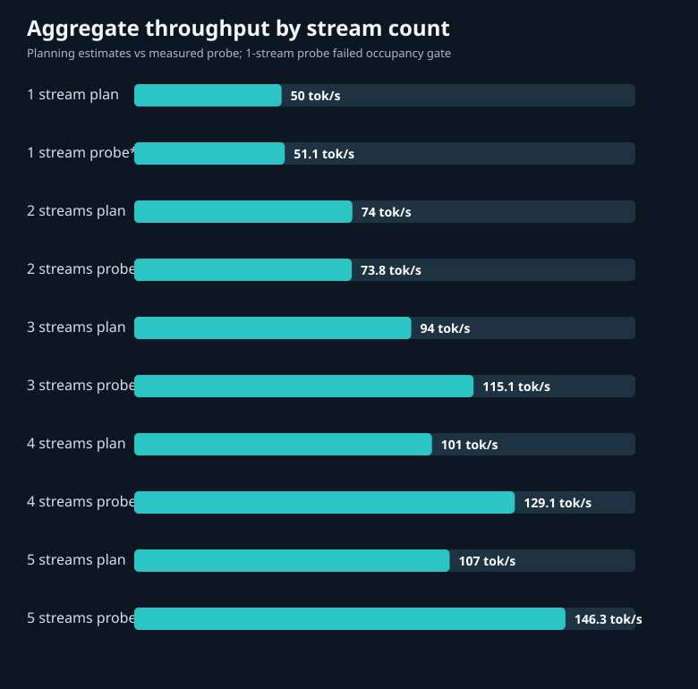

<!-- SPDX-License-Identifier: CC-BY-NC-4.0 -->
<p align="center"></p>

# Qwen3.8 Flash · DGX UltraFast

A measured vLLM serving recipe for Qwen3.8-Flash-Next on one GB10.

Based on [Saren-Arterius/qwen3.8-Flash-DGX-AutoRound](https://github.com/Saren-Arterius/qwen3.8-Flash-DGX-AutoRound) (Apache-2.0, (c) blazux).

**73.2 tok/s peak single-stream decode** and **146.3 tok/s peak aggregate decode at five streams** on one GB10. Supporting medians: **69.0 tok/s** for copy-heavy single requests, **48.8 tok/s** for agent-shaped single requests, and **97.1 tok/s** across four-stream agent-shaped probes. [Measurements and workloads](docs/BENCHMARKS.md#measured-peak-rates).

      

The repository contains the v16b launch configuration, benchmark records, T80 dense-MTP g32 builder, and staged iter6c-to-iter6d image build sources. [BUILD.md](docs/BUILD.md) walks through the public download, image, checkpoint and launch steps.

## Results at a glance

| Measure | v16b reading | Workload |
|---|---:|---|
| Single-stream decode | **73.2 tok/s peak**; **69.0 tok/s median** | Copy-heavy, low-effort requests |
| Agent-shaped single-stream decode | **48.8 tok/s median** | 18 coding requests |
| Aggregate decode | **146.3 tok/s peak** | Five equal-length, 600-token streams |
| Agent-shaped aggregate | **97.1 tok/s median** | Three four-stream probes |
| Measured equal-length aggregate, 2 / 3 / 4 / 5 streams | **73.8 / 115.1 / 129.1 / 146.3 tok/s** | One probe at each stream count |
| Decode step | **52.33 ms** | v16b candidate window |
| Warm coding / cold 64k time to first token | **0.57 s / 27.0 s** | Cached coding prompt / cold long-context prompt |
| KV pool / configured context | **16 GB / 262,144 tokens** | Promoted launch settings |
| Model residency / available memory | **~71 GiB / 16.5 GiB** | Base recipe residency / v16b capacity run low-water |
| Fixed-suite evaluation | **459/492** and **458/492** | Seeds 20260910 and 20260908 |
| Long generation | **21/24** and **22/24** | Two readings |

<p align="center"></p>

## Requirements

- One NVIDIA GB10 with roughly 121 GB unified memory, ARM64 Linux, Docker and the NVIDIA container runtime.
- A driver compatible with the pinned CUDA 13.0 image. Check `nvidia-smi` and a GPU container before building.
- Local storage for the checkpoint, fp8 PLE table, roughly 4.8 GiB of T80 shard data, downloads and Docker layers. The upstream checkpoint and table call for about 130 GB free.
- Python 3, the Hugging Face `hf` CLI, `jq`, GNU `md5sum` and `sha256sum`.

## Quick start: download, build, launch, test

The sequence downloads public checkpoint revisions, builds the image and T80 drafter directory, then launches v16b with the promoted memory settings. [BUILD.md](docs/BUILD.md) includes the reference hashes and build report.

```bash
git clone https://github.com/dime-online/qwen3.8-Flash-DGX-UltraFast.git
cd qwen3.8-Flash-DGX-UltraFast
python3 -m venv .venv
. .venv/bin/activate
pip install --upgrade huggingface_hub
mkdir -p "$HOME/models/Qwen3.8-Flash-Next-W4A16-AutoRound-hybrid" "$HOME/models/ple-table-fp8"
hf download Saren/Qwen3.8-Flash-Next-W4A16-AutoRound-hybrid \
  --revision 8b82f0b7abe3d1150a7827d298c75e86267636ae \
  --local-dir "$HOME/models/Qwen3.8-Flash-Next-W4A16-AutoRound-hybrid"
hf download Saren/Qwen3.8-Flash-Next-ple-table-fp8 \
  --revision 50511b0a41aa1d34b8beb7e5d4bb06a0b650dc14 \
  --local-dir "$HOME/models/ple-table-fp8"
bash build/image/build.sh --run
bash build/model/build.sh --run
bash config/v16b/launch.sh --print
bash config/v16b/launch.sh --run
curl -fsS http://localhost:8000/v1/models
curl -fsS http://localhost:8000/v1/chat/completions \
  -H 'Content-Type: application/json' \
  -d '{"model":"qwen","messages":[{"role":"user","content":"Reply with OK."}],"max_tokens":512}'
```

The T80 builder converts nine drafter modules at group size 32. Its reference conversion took 4.626 seconds after download and produced 5,118,048,680 new bytes. The promoted launch pins `GPU_MEM=0.01`, `KV_BYTES=16g`, `SEQS=8`, `CTX=262144`, MTP depth 3 and prefix caching. [Full build procedure](docs/BUILD.md).

## How the speed is obtained

```text
AutoRound int4 experts + fp8 side layers + int8 output head
             │
             ├── fp8 PLE table, read by mmap from storage
             ├── MTP depth 3, 65,536-id draft vocabulary, dense drafter head
             └── fast PLE gather + split CUDA graphs + prefix cache
                         ↓
                vLLM verifier and sampler → response
```

The v16b image adds a low-latency GEMM, verify-path top-k kernel and draft-block retention. The reduced vocabulary and fp8 drafter experts lower draft cost; the verifier determines emitted tokens. [Architecture](docs/ARCHITECTURE.md) · [Configuration](docs/CONFIGURATION.md).

## Benchmarks and quality

The agent-shaped benchmark used a long cached system prefix, tool schemas, six coding tasks, three repeats and 1,500 generated tokens with thinking enabled. The fixed 492-item suite covers code, math, knowledge, instruction following, tool calls and long-context needles. [Benchmark method](docs/BENCHMARKS.md) · [Evaluation results](docs/EVALS.md).

## Credits and licenses

The base recipe derives from [Saren-Arterius/qwen3.8-Flash-DGX-AutoRound](https://github.com/Saren-Arterius/qwen3.8-Flash-DGX-AutoRound), Apache-2.0, copyright blazux. Thanks to the Qwen model authors, vLLM, Intel AutoRound and FlashInfer contributors. Model weights and downloaded datasets retain their own terms.

The upstream-derived `Dockerfile`, `.dockerignore`, `prepare.sh`, `src/`, `tools/`, `scripts/`, `benchmarks/decode_bench.py`, `build/` and `config/v16b/{serve.sh,launch.sh}` remain **Apache-2.0**. Original code, where present, uses **PolyForm Noncommercial 1.0.0**; original prose, tables and assets use **CC BY-NC 4.0**. Attribution for original material is **dime-online**. See [LICENSE](LICENSE), [NOTICE](NOTICE) and [license texts](LICENSES/).

## Citation

```bibtex
@software{dime_online_qwen38_gb10_v16b,
  title = {Qwen3.8 Flash · DGX UltraFast: v16b serving recipe},
  author = {{dime-online}},
  year = {2026},
  url = {https://github.com/dime-online/qwen3.8-Flash-DGX-UltraFast}
}
```
