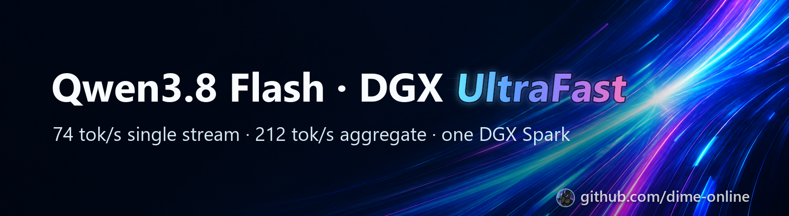
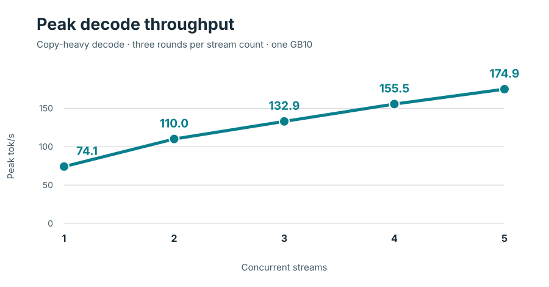

<!-- SPDX-License-Identifier: CC-BY-NC-4.0 -->
<p align="center"><a href="https://github.com/dime-online"></a></p>

# Qwen3.8 Flash · DGX UltraFast

**Run Qwen3.8-Flash-Next at up to 74 tok/s on a single NVIDIA DGX Spark, and serve up to 212 tok/s across eight users, without trading the model's intelligence for speed.**

DGX UltraFast is a ready-to-run vLLM recipe for one DGX Spark or any GB10 system. It is among the fastest ways to run Qwen3.8-Flash-Next on a single box, and it gets there by making each step of the model do more work, not by cutting the model down.

- **Fast.** Up to 74.1 tok/s single-stream and 212.2 tok/s aggregate at eight concurrent streams. Decode runs 31% faster than the recipe it builds on (52.3 ms per step instead of 68.3 ms), with output quality statistically indistinguishable from the original.
- **Smart.** Higher-precision weights than the low-bit quants most fast recipes use, and every token the drafter proposes is checked by the full model. It scores 93% on a 492-item suite of code, math, knowledge, tool calls and long-context tasks, on two seeds.
- **Built for long sessions.** A 262,144-token context and prefix caching keep long coding and agent sessions responsive.
- **Proven, not claimed.** Every speed number ships with its raw per-round data and the script that measured it, and the whole stack builds from public downloads.

Based on [Saren-Arterius/qwen3.8-Flash-DGX-AutoRound](https://github.com/Saren-Arterius/qwen3.8-Flash-DGX-AutoRound) (Apache-2.0, (c) blazux).

      

## Results at a glance

| Measure | v16b reading | Workload |
|---|---:|---|
| Peak decode, 1 stream | **74.1 tok/s** | Copy-heavy, low-effort; three rounds |
| Peak aggregate decode, 2 streams | **110.0 tok/s** | Same copy-heavy workload; three rounds |
| Peak aggregate decode, 3 streams | **132.9 tok/s** | Same copy-heavy workload; three rounds |
| Peak aggregate decode, 4 streams | **155.5 tok/s** | Same copy-heavy workload; three rounds |
| Peak aggregate decode, 5 streams | **175.8 tok/s** | Same copy-heavy workload; three rounds in the extension session |
| Peak aggregate decode, 6 streams | **191.5 tok/s** | Same copy-heavy workload; three rounds |
| Peak aggregate decode, 7 streams | **205.8 tok/s** | Same copy-heavy workload; three rounds |
| Peak aggregate decode, 8 streams | **212.2 tok/s** | Same copy-heavy workload; three rounds |
| Decode step | **52.33 ms** | v16b candidate window |
| Warm coding / cold 64k time to first token | **0.57 s / 27.0 s** | Cached coding prompt / cold long-context prompt |
| KV pool / configured context | **16 GB / 262,144 tokens** | Promoted launch settings |
| Model residency / available memory | **~71 GiB / 16.5 GiB** | Base recipe residency / v16b capacity run low-water |
| Fixed-suite evaluation | **459/492** and **458/492** | Seeds 20260910 and 20260908 |
| Long generation | **21/24** and **22/24** | Two readings |

<p align="center"><picture><source media="(prefers-color-scheme: dark)" srcset="docs/assets/throughput-dark.svg"></picture></p>

## Why it is fast, and why it stays smart

v16b serves Qwen3.8-Flash-Next on one GB10 with a fast target and a compact model-native drafter. Its **74.1 tok/s copy-heavy single-stream peak** puts it among the fastest publicly documented GB10 recipes in that workload class. The same workload reaches **212.2 tok/s peak aggregate at eight streams**. The [per-round records](docs/BENCHMARKS.md#measured-peak-rates) show the full curve.

### Keep the target precise

AutoRound W4A16 packs routed-expert weights to four bits while retaining 16-bit activations. FP8 side layers and an INT8 output head keep important nonexpert paths at eight bits. Those paths retain more precision than designs that quantize the same matrices to three or four bits. The FP8 PLE table lives in a memory-mapped file rather than entirely in GPU memory. That leaves room for the promoted **16 GB KV pool** on the GB10. Prefix caching reuses shared prompt work.

### Turn each target pass into more output

The dense T80 MTP drafter proposes three tokens ahead. A 65,536-token draft vocabulary and FP8 drafter experts make those proposals cheaper. The target verifies them with block rejection before output. In the copy-heavy single-stream run, the median was **3.69 emitted tokens per target step**, including accepted drafts. The low-latency GB10 GEMM, sort-free verify-path top-k and split CUDA graphs trim compute, selection and launch overhead around each pass. Together they form a fast serving path for the W4A16/FP8 target.

### Keep the GB10 busy with real requests

The image runs vLLM's V2 model runner. With MTP selected, async scheduling is enabled by default. The image also carries an asynchronous short-convolution host-to-device transfer and guarded recurrent-state alignment for that runner. In an agent-shaped coding run with thinking and tools, v16b measured **52.3 ms per decode step**, down from **68.3 ms** for the upstream base in interleaved windows: **31% faster decode** (23% less time per step). This separate workload demonstrates the step-time gain on agent-shaped traffic.

### Protect output quality

3-bit GGUF and NVFP4 routes compress target weights. N-gram copy speculation thrives on repeated spans, while structured-output tasks reward predictable drafting. Here, the dense MTP head proposes tokens from the model, and block rejection checks them against the W4A16/FP8 target. The same path can draft original code, reasoning and tool output without a matching prior span. The fixed 492-item suite scored **459/492** and **458/492** over two seeds, covering code, math, knowledge, instructions, tools and long-context needles. Long-generation readings scored **21/24** and **22/24**. Teacher-forced top-1 agreement changed by **−0.06 percentage points**, inside its pre-registered **0.15-point** control band.

## What is in the repository

The [recipe](recipe/) contains the v16b launch configuration, T80 dense-MTP g32 builder and staged iter6c-to-iter6d image build sources. [Build instructions](docs/BUILD.md) cover the public downloads, image, checkpoint and launch steps; [results](docs/results/) contain the measurement tables, and the [measured 1–8 stream curve](docs/BENCHMARKS.md#measured-peak-rates) uses one copy-heavy workload and one decode-window metric throughout.

## Requirements

- One NVIDIA GB10 with roughly 121 GB unified memory, ARM64 Linux, Docker and the NVIDIA container runtime.
- A driver compatible with the pinned CUDA 13.0 image. Check `nvidia-smi` and a GPU container before building.
- Local storage for the checkpoint, fp8 PLE table, roughly 4.8 GiB of T80 shard data, downloads and Docker layers. The upstream checkpoint and table call for about 130 GB free.
- Python 3, the Hugging Face `hf` CLI, `jq`, GNU `md5sum` and `sha256sum`.

## Quick start: download, build, launch, test

The sequence downloads public checkpoint revisions, builds the image and T80 drafter directory, then launches v16b with the promoted memory settings. [BUILD.md](docs/BUILD.md) includes the reference hashes and build report.

```bash
git clone https://github.com/dime-online/qwen3.8-Flash-DGX-UltraFast.git
cd qwen3.8-Flash-DGX-UltraFast
python3 -m venv recipe/.venv
. recipe/.venv/bin/activate
pip install --upgrade huggingface_hub
mkdir -p "$HOME/models/Qwen3.8-Flash-Next-W4A16-AutoRound-hybrid" "$HOME/models/ple-table-fp8"
hf download Saren/Qwen3.8-Flash-Next-W4A16-AutoRound-hybrid \
  --revision 8b82f0b7abe3d1150a7827d298c75e86267636ae \
  --local-dir "$HOME/models/Qwen3.8-Flash-Next-W4A16-AutoRound-hybrid"
hf download Saren/Qwen3.8-Flash-Next-ple-table-fp8 \
  --revision 50511b0a41aa1d34b8beb7e5d4bb06a0b650dc14 \
  --local-dir "$HOME/models/ple-table-fp8"
bash recipe/build/image/build.sh --run
bash recipe/build/model/build.sh --run
bash recipe/config/v16b/launch.sh --print
bash recipe/config/v16b/launch.sh --run
curl -fsS http://localhost:8000/v1/models
curl -fsS http://localhost:8000/v1/chat/completions \
  -H 'Content-Type: application/json' \
  -d '{"model":"qwen","messages":[{"role":"user","content":"Reply with OK."}],"max_tokens":512}'
```

The T80 builder converts nine drafter modules at group size 32. Its reference conversion took 4.626 seconds after download and produced 5,118,048,680 new bytes. The promoted launch pins `GPU_MEM=0.01`, `KV_BYTES=16g`, `SEQS=8`, `CTX=262144`, MTP depth 3 and prefix caching. [Full build procedure](docs/BUILD.md).

## How the speed is obtained

```text
AutoRound int4 experts + fp8 side layers + int8 output head
             │
             ├── fp8 PLE table, read by mmap from storage
             ├── MTP depth 3, 65,536-id draft vocabulary, dense drafter head
             └── fast PLE gather + split CUDA graphs + prefix cache
                         ↓
                vLLM verifier and sampler → response
```

The v16b image adds a low-latency GEMM, verify-path top-k kernel and draft-block retention. The reduced vocabulary and fp8 drafter experts lower draft cost; the verifier determines emitted tokens. [Architecture](docs/ARCHITECTURE.md) · [Configuration](docs/CONFIGURATION.md).

## Benchmarks and quality

The copy-heavy stream benchmark ran three rounds at each count with a shared 9,600-token cached prefix and low reasoning effort. Its [runner](recipe/benchmarks/bench_copy_streams.py) and [per-round data from both sessions](docs/BENCHMARKS.md#measured-peak-rates) are included. The separate agent-shaped benchmark used six coding tasks, three repeats and thinking enabled. The fixed 492-item suite covers code, math, knowledge, instruction following, tool calls and long-context needles. [Benchmark method](docs/BENCHMARKS.md) · [Evaluation results](docs/EVALS.md).

## Credits and licenses

The base recipe derives from [Saren-Arterius/qwen3.8-Flash-DGX-AutoRound](https://github.com/Saren-Arterius/qwen3.8-Flash-DGX-AutoRound), Apache-2.0, copyright blazux. Thanks to the Qwen model authors, vLLM, Intel AutoRound and FlashInfer contributors. Model weights and downloaded datasets retain their own terms.

The upstream-derived `recipe/{Dockerfile,.dockerignore,prepare.sh,src/,tools/,scripts/,build/}`, `recipe/benchmarks/decode_bench.py` and `recipe/config/v16b/{serve.sh,launch.sh}` remain **Apache-2.0**. Original code, where present, uses **PolyForm Noncommercial 1.0.0**; original prose, tables and assets use **CC BY-NC 4.0**. Attribution for original material is **dime-online**. See [LICENSE](LICENSE), [NOTICE](docs/NOTICE) and [license texts](docs/LICENSES/).

## Citation

GitHub's citation menu reads [CITATION.cff](CITATION.cff) from the repository root.

```bibtex
@software{dime_online_qwen38_gb10_v16b,
  title = {Qwen3.8 Flash · DGX UltraFast: v16b serving recipe},
  author = {{dime-online}},
  year = {2026},
  url = {https://github.com/dime-online/qwen3.8-Flash-DGX-UltraFast}
}
```
