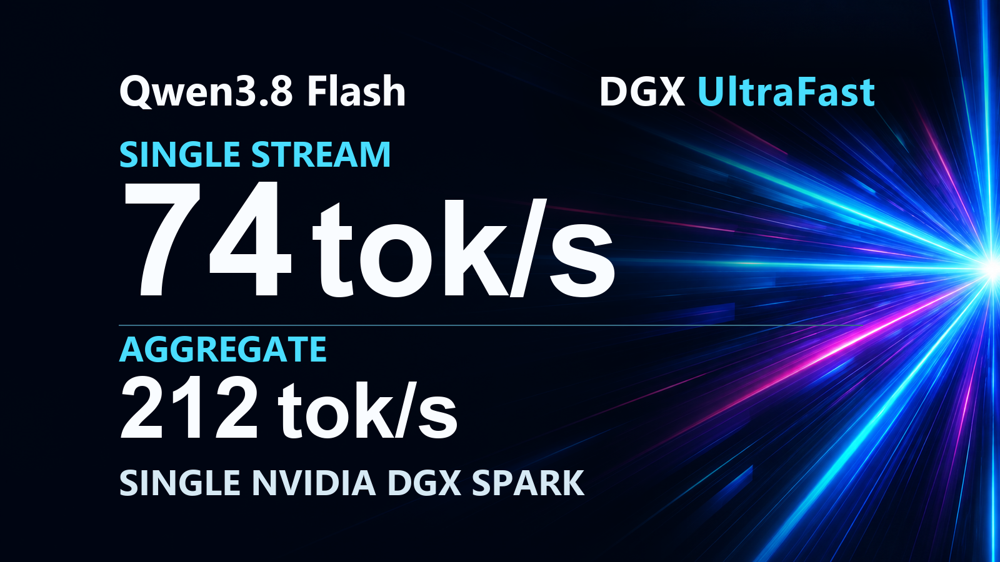

<!-- SPDX-License-Identifier: CC-BY-NC-4.0 -->
<p align="center"></p>

# Qwen3.8 Flash · DGX UltraFast

A public, digest-pinned vLLM recipe for Qwen3.8-Flash-Next on one GB10, with the image build, dense-MTP drafter builder, measured throughput rounds and quality record in the repository.

Based on [Saren-Arterius/qwen3.8-Flash-DGX-AutoRound](https://github.com/Saren-Arterius/qwen3.8-Flash-DGX-AutoRound) (Apache-2.0, (c) blazux).

**74.1 tok/s peak single-stream decode · 212.2 tok/s peak aggregate at eight streams on one GB10.** The [measured 1–8 stream curve](docs/BENCHMARKS.md#measured-peak-rates) uses one copy-heavy workload and one decode-window metric throughout.

      

The [recipe](recipe/) contains the v16b launch configuration, T80 dense-MTP g32 builder and staged iter6c-to-iter6d image build sources. [Build instructions](docs/BUILD.md) cover the public downloads, image, checkpoint and launch steps; [results](docs/results/) contain the measurement tables.

## Results at a glance

| Measure | v16b reading | Workload |
|---|---:|---|
| Peak decode, 1 stream | **74.1 tok/s** | Copy-heavy, low-effort; three rounds |
| Peak aggregate decode, 2 streams | **110.0 tok/s** | Same copy-heavy workload; three rounds |
| Peak aggregate decode, 3 streams | **132.9 tok/s** | Same copy-heavy workload; three rounds |
| Peak aggregate decode, 4 streams | **155.5 tok/s** | Same copy-heavy workload; three rounds |
| Peak aggregate decode, 5 streams | **175.8 tok/s** | Same copy-heavy workload; three rounds in the extension session |
| Peak aggregate decode, 6 streams | **191.5 tok/s** | Same copy-heavy workload; three rounds |
| Peak aggregate decode, 7 streams | **205.8 tok/s** | Same copy-heavy workload; three rounds |
| Peak aggregate decode, 8 streams | **212.2 tok/s** | Same copy-heavy workload; three rounds |
| Decode step | **52.33 ms** | v16b candidate window |
| Warm coding / cold 64k time to first token | **0.57 s / 27.0 s** | Cached coding prompt / cold long-context prompt |
| KV pool / configured context | **16 GB / 262,144 tokens** | Promoted launch settings |
| Model residency / available memory | **~71 GiB / 16.5 GiB** | Base recipe residency / v16b capacity run low-water |
| Fixed-suite evaluation | **459/492** and **458/492** | Seeds 20260910 and 20260908 |
| Long generation | **21/24** and **22/24** | Two readings |

<p align="center"><picture><source media="(prefers-color-scheme: dark)" srcset="docs/assets/throughput-dark.svg"></picture></p>

## Why it is fast, and why it stays smart

v16b combines a precision-conscious target with a compact model-native drafter, tuned for one GB10. Its **74.1 tok/s peak** on the copy-heavy single-stream test puts it among the fastest publicly documented Qwen3.8-Flash-Next GB10 recipes in that workload class. The same workload reaches **212.2 tok/s peak aggregate at eight streams**. The [per-round records](docs/BENCHMARKS.md#measured-peak-rates) show how the curve was measured.

### Precision in the target

The credited upstream checkpoint uses AutoRound W4A16 experts: four-bit expert weights with 16-bit activations. This recipe keeps FP8 side layers and an INT8 output head, rather than compressing those paths along with the experts into the lowest-bit formats. It retains higher precision in activations, side layers and the output head than approaches that quantize those same paths to three or four bits. The FP8 PLE table is memory-mapped from storage instead of held fully in GPU memory; the promoted launch allocates a 16 GB KV pool. Prefix caching saves repeated prompt work.

### More tokens from each step

The T80 dense-MTP drafter proposes three tokens ahead. Its 65,536-token draft vocabulary and FP8 drafter experts reduce proposal cost; the target checks candidates before they become output. At one stream, the median was **3.69 emitted tokens per target step**, including accepted drafts. The GB10 low-latency GEMM, sort-free verify-path top-k and split CUDA graphs reduce work around those steps. In the separate agent-shaped coding window, v16b measured **52.33 ms per step** against **68.276 ms** for the upstream base in interleaved tests, a **23%** reduction. The image also includes V2-compatible recurrent-state alignment and an asynchronous short-convolution metadata transfer; the measured launch uses synchronous scheduling.

### Speed earned from the model

3-bit GGUF and NVFP4 approaches put more emphasis on weight packing; n-gram copy speculation can reuse text already in context, and structured-output tests make continuations especially predictable. This recipe's acceleration instead uses the model's own dense MTP drafter and target-side verification. The mechanism also applies when the next phrase has not appeared earlier in the prompt. Its agent-shaped coding benchmark includes tools and thinking; the measured step-time gain there complements the copy-heavy peak without treating that peak as a general-use rate.

### Quality checked in outputs

Draft verification follows the quantized target's token distribution; it does not substitute a copy heuristic for the target. Two seeds of the fixed 492-item evaluation scored **459/492** and **458/492** across code, math, knowledge, instructions, tool calls and long-context needles. The separate long-generation readings scored **21/24** and **22/24**. A teacher-forced comparison measured a **−0.06 percentage-point** top-1 agreement change, inside its pre-registered **0.15-point** control band. Together these records show the recipe's speed alongside measured behavior on varied tasks, with the target model making the final token decisions.

## Requirements

- One NVIDIA GB10 with roughly 121 GB unified memory, ARM64 Linux, Docker and the NVIDIA container runtime.
- A driver compatible with the pinned CUDA 13.0 image. Check `nvidia-smi` and a GPU container before building.
- Local storage for the checkpoint, fp8 PLE table, roughly 4.8 GiB of T80 shard data, downloads and Docker layers. The upstream checkpoint and table call for about 130 GB free.
- Python 3, the Hugging Face `hf` CLI, `jq`, GNU `md5sum` and `sha256sum`.

## Quick start: download, build, launch, test

The sequence downloads public checkpoint revisions, builds the image and T80 drafter directory, then launches v16b with the promoted memory settings. [BUILD.md](docs/BUILD.md) includes the reference hashes and build report.

```bash
git clone https://github.com/dime-online/qwen3.8-Flash-DGX-UltraFast.git
cd qwen3.8-Flash-DGX-UltraFast
python3 -m venv recipe/.venv
. recipe/.venv/bin/activate
pip install --upgrade huggingface_hub
mkdir -p "$HOME/models/Qwen3.8-Flash-Next-W4A16-AutoRound-hybrid" "$HOME/models/ple-table-fp8"
hf download Saren/Qwen3.8-Flash-Next-W4A16-AutoRound-hybrid \
  --revision 8b82f0b7abe3d1150a7827d298c75e86267636ae \
  --local-dir "$HOME/models/Qwen3.8-Flash-Next-W4A16-AutoRound-hybrid"
hf download Saren/Qwen3.8-Flash-Next-ple-table-fp8 \
  --revision 50511b0a41aa1d34b8beb7e5d4bb06a0b650dc14 \
  --local-dir "$HOME/models/ple-table-fp8"
bash recipe/build/image/build.sh --run
bash recipe/build/model/build.sh --run
bash recipe/config/v16b/launch.sh --print
bash recipe/config/v16b/launch.sh --run
curl -fsS http://localhost:8000/v1/models
curl -fsS http://localhost:8000/v1/chat/completions \
  -H 'Content-Type: application/json' \
  -d '{"model":"qwen","messages":[{"role":"user","content":"Reply with OK."}],"max_tokens":512}'
```

The T80 builder converts nine drafter modules at group size 32. Its reference conversion took 4.626 seconds after download and produced 5,118,048,680 new bytes. The promoted launch pins `GPU_MEM=0.01`, `KV_BYTES=16g`, `SEQS=8`, `CTX=262144`, MTP depth 3 and prefix caching. [Full build procedure](docs/BUILD.md).

## How the speed is obtained

```text
AutoRound int4 experts + fp8 side layers + int8 output head
             │
             ├── fp8 PLE table, read by mmap from storage
             ├── MTP depth 3, 65,536-id draft vocabulary, dense drafter head
             └── fast PLE gather + split CUDA graphs + prefix cache
                         ↓
                vLLM verifier and sampler → response
```

The v16b image adds a low-latency GEMM, verify-path top-k kernel and draft-block retention. The reduced vocabulary and fp8 drafter experts lower draft cost; the verifier determines emitted tokens. [Architecture](docs/ARCHITECTURE.md) · [Configuration](docs/CONFIGURATION.md).

## Benchmarks and quality

The copy-heavy stream benchmark ran three rounds at each count with a shared 9,600-token cached prefix and low reasoning effort. Its [runner](recipe/benchmarks/bench_copy_streams.py) and [per-round data from both sessions](docs/BENCHMARKS.md#measured-peak-rates) are included. The separate agent-shaped benchmark used six coding tasks, three repeats and thinking enabled. The fixed 492-item suite covers code, math, knowledge, instruction following, tool calls and long-context needles. [Benchmark method](docs/BENCHMARKS.md) · [Evaluation results](docs/EVALS.md).

## Credits and licenses

The base recipe derives from [Saren-Arterius/qwen3.8-Flash-DGX-AutoRound](https://github.com/Saren-Arterius/qwen3.8-Flash-DGX-AutoRound), Apache-2.0, copyright blazux. Thanks to the Qwen model authors, vLLM, Intel AutoRound and FlashInfer contributors. Model weights and downloaded datasets retain their own terms.

The upstream-derived `recipe/{Dockerfile,.dockerignore,prepare.sh,src/,tools/,scripts/,build/}`, `recipe/benchmarks/decode_bench.py` and `recipe/config/v16b/{serve.sh,launch.sh}` remain **Apache-2.0**. Original code, where present, uses **PolyForm Noncommercial 1.0.0**; original prose, tables and assets use **CC BY-NC 4.0**. Attribution for original material is **dime-online**. See [LICENSE](LICENSE), [NOTICE](docs/NOTICE) and [license texts](docs/LICENSES/).

## Citation

GitHub's citation menu reads [CITATION.cff](CITATION.cff) from the repository root.

```bibtex
@software{dime_online_qwen38_gb10_v16b,
  title = {Qwen3.8 Flash · DGX UltraFast: v16b serving recipe},
  author = {{dime-online}},
  year = {2026},
  url = {https://github.com/dime-online/qwen3.8-Flash-DGX-UltraFast}
}
```
