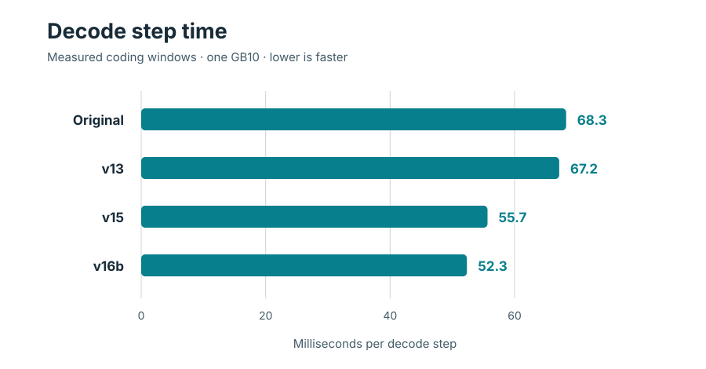

<!-- SPDX-License-Identifier: CC-BY-NC-4.0 -->
# Benchmarks

These v16b measurements use one GB10, the promoted image and the T80 drafter checkpoint. The [summary CSV](results/throughput.csv), [per-round CSV](results/copy-streams-rounds.csv) and [raw rounds](results/copy-streams-rounds.json) record the copy-heavy run.

## Measured peak rates

| Streams | Peak decode tok/s | Typical median tok/s | Median tokens/step | Median TTFT, s |
|---:|---:|---:|---:|---:|
| 1 | **74.13** | 69.61 | 3.69 | 0.61 |
| 2 | **110.02** | 108.52 | 3.83 | 1.23 |
| 3 | **132.89** | 130.93 | 3.79 | 1.63 |
| 4 | **155.46** | 152.93 | 3.75 | 1.97 |
| 5 | **174.87** | 170.12 | 3.73 | 2.61 |

All five levels use the same copy-heavy, low-effort workload, three rounds each and a shared cached prefix. Each peak is the fastest round at that stream count; the typical median is the middle of its three rounds. Every stream reported 9,600 cached prompt tokens. Aggregate decode tok/s counts completion tokens during the all-decoding window, from the latest first token to the earliest stream finish, divided by that window. The public [benchmark runner](../recipe/benchmarks/bench_copy_streams.py) includes generated copy tasks and also accepts a JSON workload with system, tools and task text.

<picture><source media="(prefers-color-scheme: dark)" srcset="assets/throughput-dark.svg"></picture>

## Agent-shaped decode

The coding benchmark used a cached long system prefix, tool schemas, six coding tasks, three repeats per task and 1,500 generated tokens, with thinking enabled. The v16b candidate window measured **52.33 ms per decode step**. The interleaved original, v13 and v15 windows measured 68.276, 67.167 and 55.65 ms respectively.

| Recipe | Measured step time, ms |
|---|---:|
| Original | 68.276 |
| v13 | 67.167 |
| v15 | 55.65 |
| v16b | **52.33** |

<picture><source media="(prefers-color-scheme: dark)" srcset="assets/speed-ladder-dark.svg"></picture>

## Stream count and time to first token

The copy-heavy run measured **74.13 / 110.02 / 132.89 / 155.46 / 174.87 tok/s peak decode throughput** at **1 / 2 / 3 / 4 / 5 streams**. The TTFT column above gives the median across requests at each level. The [per-round table](results/copy-streams-rounds.csv) also records simple total-tokens-per-wall-time alongside decode-window throughput.

Warm time to first token on the cached coding prompt measured **0.57 s**. Long-context cold time to first token measured **4.1 / 27.0 / 59.2 s** at 16k / 64k / 128k prompt tokens. Warm cached readings at those lengths measured **0.963 / 0.682 / 0.465 s**. Each long-context cell had three repeats.
